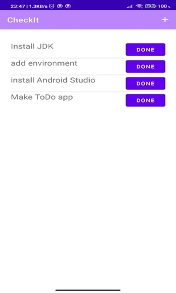
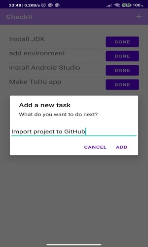

# CheckIt

App for keeping a list of things to do & buy

## Software Used
The ingredients every Android developer needs are:

1. Android Studio, the official Android IDE (integrated development environment ).
2. The Android SDK is the toolchain that manages everything required to build an Android app. 
   It ships with Android Studio, but if you decide to use another IDE, you’ll have to download it.
3. An Android device to test the app during development.You can also use the default emulator or Genymotion.
4. Basic Java knowledge

## ScreenShots

<table>
  <tr>
    <td>Splash Screen</td>
    <td>Main Page</td>
    <td>Add the task</td>
  </tr>
  <tr>
    <td></td>
    <td></td>
    <td></td>
  </tr>
 </table>

